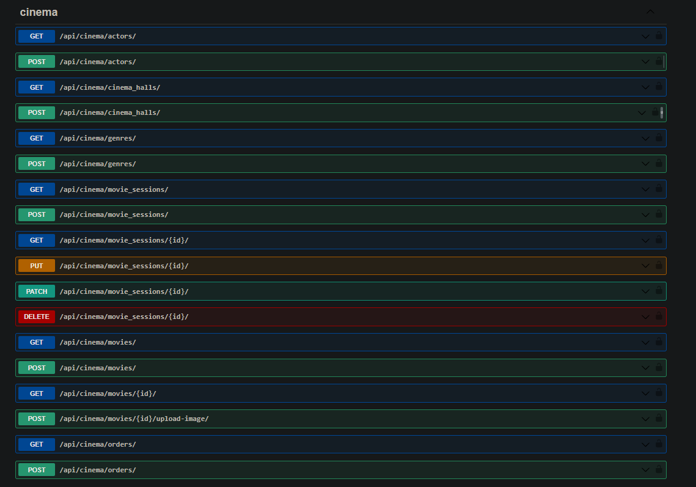
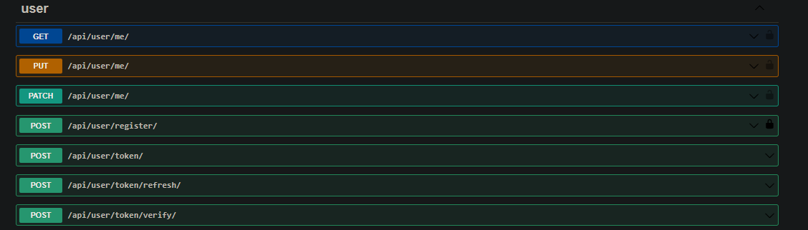

# Dockerized DRF Cinema
<i>Interesting project which describes real cinema with all necessary features</i>

## Installation
<hr>

Clone the repository <br>
If want - specify another folder name where `cinema`

```shell
git clone https://github.com/usrofgh/drf_dockerized_cinema.git cinema
cd cinema
```

### Local run
<hr>

#### Linux:

```shell
python -m venv venv
source venv/bin/activate
pip install -r requirements.txt
export POSTGRES_HOST=your_POSTGRES_HOST
export POSTGRES_DB=your_POSTGRES_DB
export POSTGRES_USER=your_POSTGRES_USER
export POSTGRES_PASSWORD=your_POSTGRES_PASSWORD
export SECRET_KEY=your_SECRET_KEY
export DEBUG=True
```

#### Windows
```shell
python -m venv venv
venv\Scripts\activate
pip install -r requirements.txt
SET POSTGRES_HOST=localhost
SET POSTGRES_DB=your_POSTGRES_DB
SET POSTGRES_USER=your_POSTGRES_USER
SET POSTGRES_PASSWORD=your_POSTGRES_PASSWORD
SET SECRET_KEY=your_SECRET_KEY
SET DEBUG=True
```

```shell
python manage.py runserver
```
Fine. You can use the project
[http://127.0.0.1:8000/api/cinema/](http://127.0.0.1:8000/api/cinema/)
<hr>

### Docker run

```shell
docker-compose build
docker compose up
```
For use all features of this project you need create a user
```shell
docker exec -it <cinema_app_name> bash
python manage.py createsuperuser
```
After creating can exit
```shell
exit
```
Fine. You can use the project
[http://127.0.0.1:8000/api/cinema/](http://127.0.0.1:8000/api/cinema/)

### Connect DB into PyCharm

<hr>
If you wish you can connect DB for viewing the tables

Postgres DB should be created for connecting
<br>

```
Database Tab -> Click Plus -> Data Source -> PostgreSQL
Specify all necessary data and specify(!) 5433 port
```

## Features

<hr>

- JWT authenticated (access, refresh through API)
- Admin panel
- Documentation: [swagger](http://127.0.0.1:8000/api/doc/swagger/), [redoc](http://127.0.0.1:8000/api/doc/redoc/)</li>

- Managing tickets and orders
- CRUD for resources through API and admin panel
- Filter movies by genres, actors, title


## Endpoints
<hr>

#### Cinema


#### User
